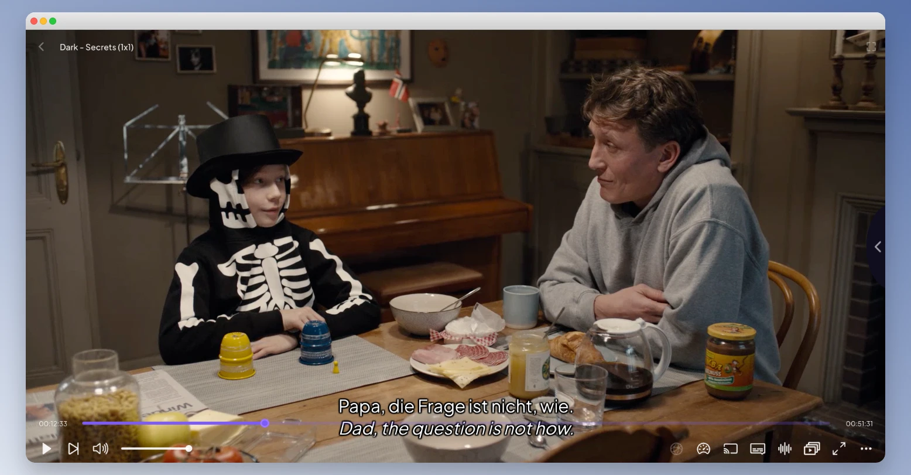

# Groq Subs

Fetches subtitles from the public Stremio OpenSubtitles v3 addon, translates them with the **Groq API**, merges them together and serves generated WebVTT subtitles to Stremio. A Groq API key is required.

The translation prompt follows high-quality cinema/Asian-drama subtitle rules (Vietnamese-ized): correct pronoun usage (Anh-Em, Tớ-Cậu, Hắn-Tôi...), no profanity, no "Mày-Tao", natural localized phrasing.



## Setup

Install dependencies:

```bash
pnpm install
```

Set your Groq API key (optional in env, or enter it in the web UI):

```bash
cp .env.example .env
# edit .env and set GROQ_API_KEY=...
```

## Run

```bash
pnpm start
```

Open the local web interface, choose source/target languages, pick a Groq model, paste your Groq API key and (optionally) click **Test API key**:

```text
http://127.0.0.1:53100/
```

Install it on Stremio using instructions from the web interface.

The generated subtitle is one double subtitle: source language on top, translated language on the bottom.

### Groq models

The addon supports selecting one of these models (the selected one becomes the default for that configured addon instance):

- `groq/compound-mini`
- `llama-3.1-8b-instant`
- `llama-3.3-70b-versatile` (default)
- `openai/gpt-oss-120b`
- `openai/gpt-oss-20b`
- `qwen/qwen3.6-27b`

### Test API key

`GET /test-groq?apiKey=<base64url-key>&model=<model>` verifies the Groq API key by sending a minimal request to the Groq Chat Completions API.

### Docker

```bash
docker run -p 53100:53100 -e GROQ_API_KEY=... ghcr.io/awerks/stremio-double-subtitles:latest
```

then open the local web interface.

## Deploy (Render / Vercel / Railway)

- Set `GROQ_API_KEY` to your Groq API key.
- The public URL is **auto-detected** from the request (`x-forwarded-proto`/`x-forwarded-host`), so you usually do not need to set it. If you use a custom domain or the auto-detection does not work, set `PUBLIC_URL` (e.g. `https://groq-subs.onrender.com`).
- Optionally set `GROQ_MODEL` to a non-default model (same list as the web dropdown).
- Free-tier Groq rate limits apply per model; the addon round-robins across models and resumes partial translations to stay within quota.
